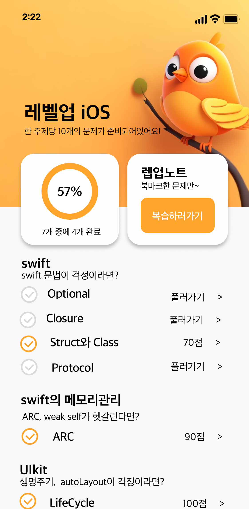
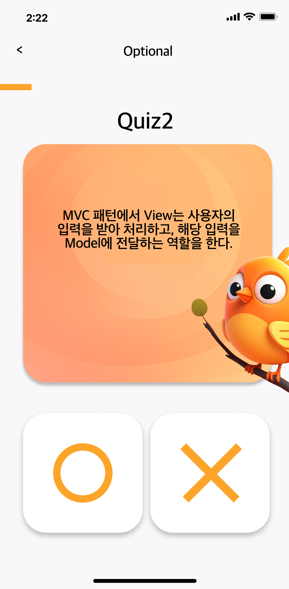
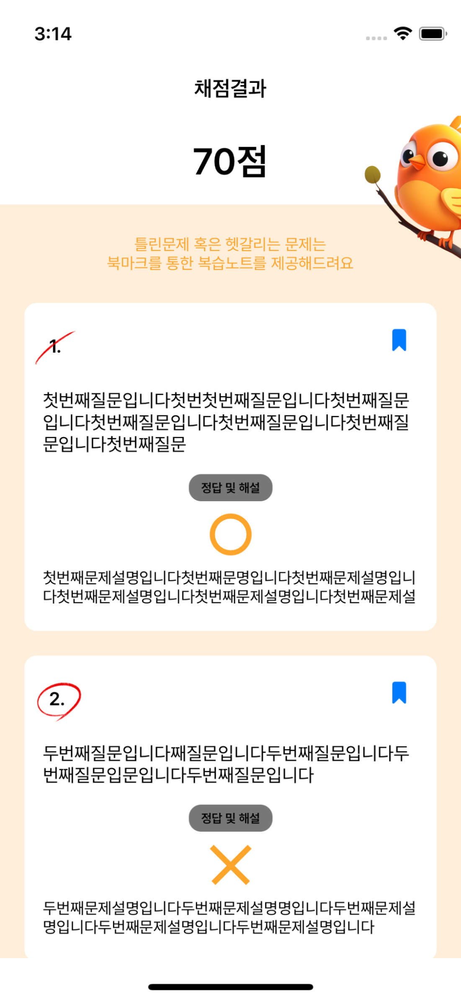
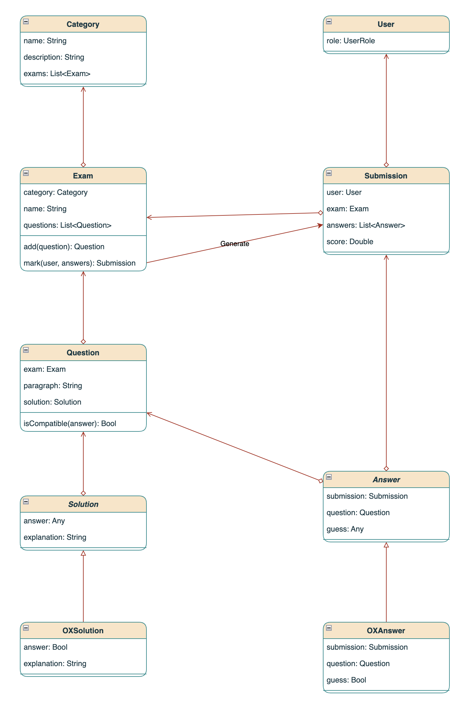
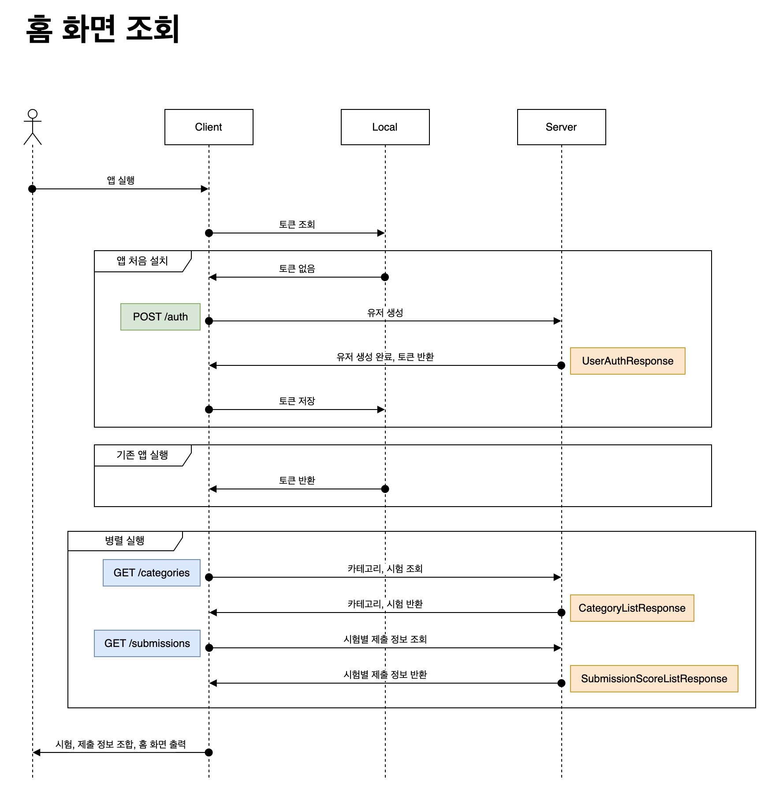
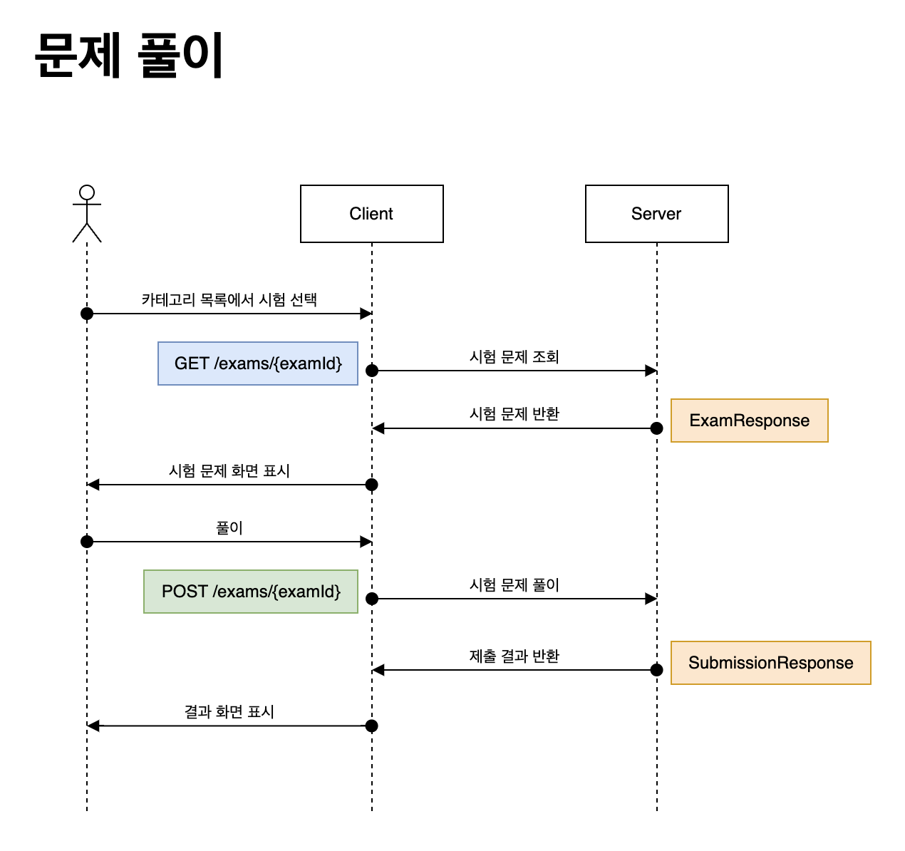
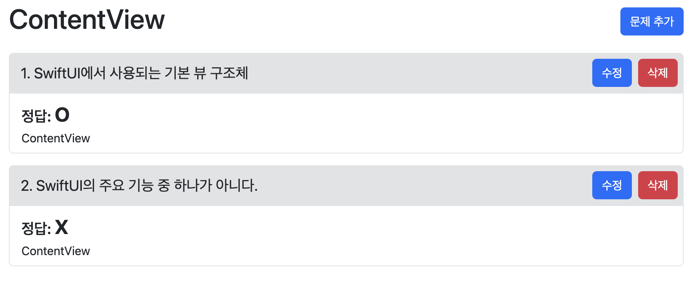

# LevelUpiOS

<div>
    
    
    
    
    
    
    
    
</div>

## Description

> iOS 개발과 관련된 주제를 복습하기 위한 다양한 퀴즈를 제공하는 앱 서비스입니다.

## Feature

|                     메인                     |                         문제                         |                     채점                     |
|:------------------------------------------:|:--------------------------------------------------:|:------------------------------------------:|
|  |  |  |

## Class Diagram



## Sequence Diagram

### 홈 화면 조회



### 문제 풀이



## 관리자 페이지



## How to run

```Bash
# .env 파일을 통한 변수 설정
docker-compose up -d
```

## Versions

|     날짜     |  버전   |     주요 변경사항      |           문서 링크            |
|:----------:|:-----:|:----------------:|:--------------------------:|
| 2024-02-02 | 0.1.0 |   사용자용 API 구현    | [link](docs/Version_0_1_0.md) |
| 2024-02-05 | 0.1.1 | CI/CD, 문서 작성, 로깅 | [link](docs/Version_0_1_1.md) |
| 2024-02-11 | 0.1.2 |    관리자 기능 구현     | [link](docs/Version_0_1_2.md) |

## How to run
```Bash
# .env 파일을 통한 변수 설정
docker-compose up -d
```
## See Also

- [iOS App](https://github.com/LevelUpiOS/LevelUpiOS-iOS)
- [Blog](https://yeongwoo-owo.notion.site/iOS-f76e30020fd34b82880a492e38a70e3f)
