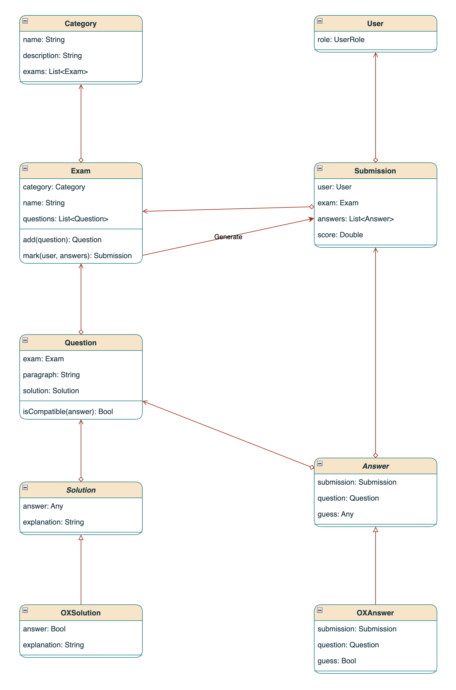
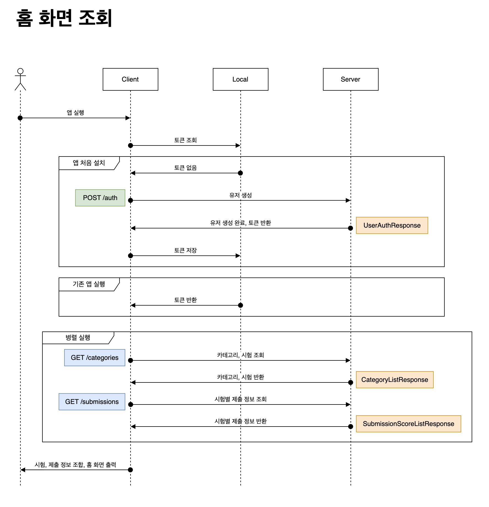
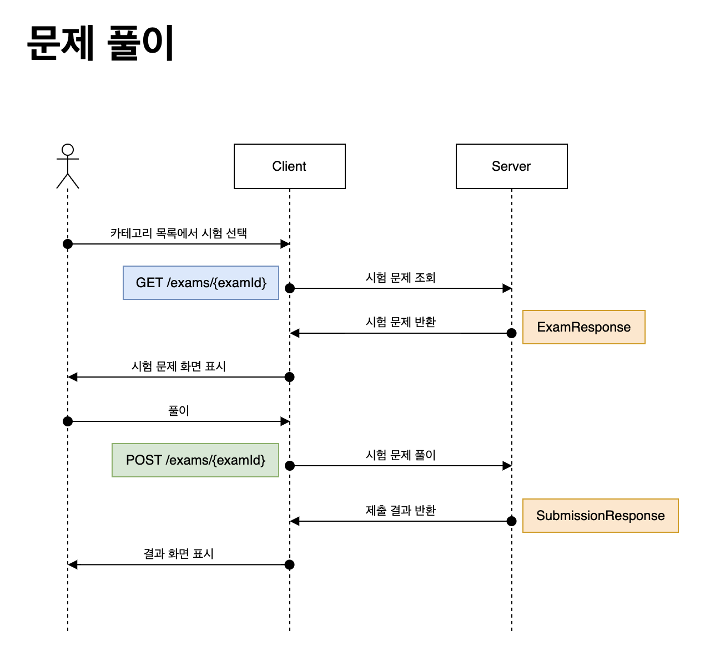

# Version 0.1.0

## 주요 기능
### DB Schema 설계
- DB Table 설계
- JPA을 통한 Entity Mapping

### Entity 구현
- Category
- Exam
- Question
- Solution
  - OXSolution
- User
- Submission
- Answer
  - OXAnswer

### 사용자용 API 구현 (v1)
- 사용자 인증 (/auth)
- 카테고리 조회 (/categories)
- 풀이 조회 (/submissions)
- 시험 문제 조회 (/exams/{examId})
- 시험 문제 풀기 (/exams/{examId})
- 문제 풀이 조회 (/submissions/{submissionId})

### API 문서 작성
- Swagger(SpringDoc) 기반 API 문서 자동화

### Cloud Server 배포
- Docker 환경 설정 (Docker Compose)
- CI/CD 파이프라인 구축 (Github Actions, AWS EC2)

## Class Diagram

## Sequence Diagram
### 홈 화면 조회

### 문제 풀이
